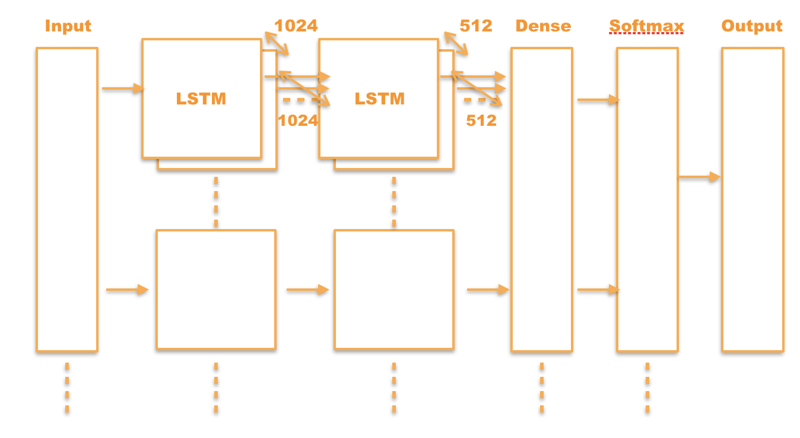
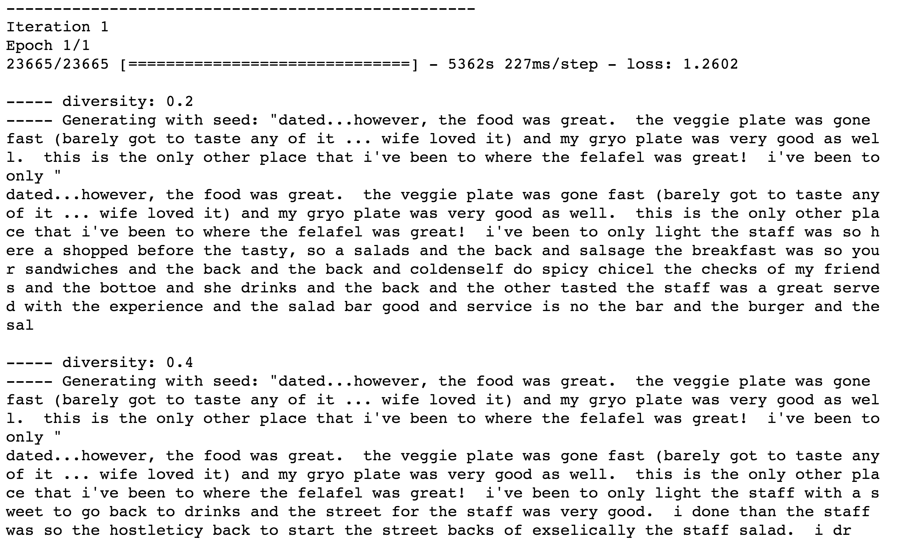

*阅读本文的其他语言版本：[English](README.md)。*

## 使用 Keras 和 Tensorflow 训练深度学习语言模型

此 Code Pattern 将指导您安装 Keras 和 Tensorflow、下载 Yelp 评论数据，并使用循环神经网络 (RNN) 训练语言模型以生成文本。

> 此 Code Pattern 的灵感来源于 [Hacknoon 博客帖子](https://hackernoon.com/how-to-generate-realistic-yelp-restaurant-reviews-with-keras-c1167c05e86d)，并已整合到 Notebook 中。文本的生成方法类似于 [Keras 文本生成演示](https://github.com/keras-team/keras/blob/master/examples/lstm_text_generation.py)，只需稍作更改便可适应此场景。

使用深度学习生成信息是一个热门的研究和试验领域。尤其值得注意的是，RNN 深度学习模型方法可适用于近乎无限数量的领域，无论是用来解决当前问题的方案还是孵化未来技术的应用。文本生成是这些应用领域之一，也是本 Code Pattern 介绍的内容。文本生成用于语言翻译、机器学习和拼写纠正。这些全部都是通过所谓的语言模型来创建的。本 Code Pattern 探讨的是：使用长短期记忆 (LSTM) RNN 的语言模型。对于部分上下文，RNN 通过带有隐藏记忆层的网络使用最高概率预测下一个步骤。与卷积神经网络 (CNNs) 使用正向传播（更确切地说，是沿其管道向前移动）不同的是，RNN 利用了反向传播或沿管道回转来使用上面提到的“记忆”。通过这种方式，RNNs 可以使用输入的文本来了解如何生成后续字母或字符作为其输出。输出随后会形成一个单词，最终会获得一个单词集合或句子和段落。通过模型的 LSTM 部分，您可以利用经过改进的长期依赖项学习或更好的记忆来构建更大的 RNN 模型。这意味着我们生成单词和句子的性能得到提升！

此模型的重要意义在于，在解决各行各业的翻译、拼写和评论问题时，人们对文本生成的需求正不断提升。尤其突出的是，抵制虚假评论在这一研究领域扮演着重要角色。虚假评论对于像 Amazon 和 Yelp 这样的公司是一个切实存在的问题，此类公司依赖于用户的真实评论为其站点上展示的特色产品和业务提供担保。对于编写此类评论而言，企业可以很轻松地付费购买虚假的正面评论，最终提升销售额和收入。为竞争企业生成负面评论同样也可轻而易举地实现。不幸的是，这会导致用户遭欺骗进入各种场所、购买各种产品，最终可能会导致产生负面体验，甚至更糟。为了打击此类滥用和非法活动，文本生成可用于检测评论生成时可能显示的内容，将其与真实用户撰写的真实评论进行对比。此 Code Pattern 会指导您完成在高级别创建此文本生成的步骤。我们将探讨如何通过少量 Yelp 评论数据来处理此问题，随后，您就可以将其应用于更大的集合，并检验得到的输出！

在 [Kaggle](https://www.kaggle.com/c/yelp-recruiting/data) 上可找到此 Code Pattern 中使用的原始 Yelp 数据，此数据在此存储库中以 [zip 文件](yelp_test_set.zip)形式提供。

### 什么是 Keras 和 Tensorflow？

如果您已单击此 Code Pattern，我猜想您可能是深度学习初级用户或中级用户，并且想要了解更多信息。无论您属于哪一个层面，都可能会认为机器学习和深度学习很棒（我对此表示认同），并且可能已经接触过各种示例和术语。您可能还对 Python 有所了解，并且也认识到深度学习属于机器学习的范畴（机器学习整体上属于人工智能的范畴）。有了这些假设，我就可以解释 Tensorflow 是一个用于机器学习的开源软件库，可用于跟踪所有模型并通过强大的可视化功能来查看这些模型。 

Keras 是一个深度学习库，可与 Tensorflow 和其他几种深度学习库配合使用。Keras 对用户非常友好，因为它只需很少的几行代码即可完成一个模型（例如，使用 RNN），这使每个数据科学家（包括我自己）的工作都得到了显著的简化！此项目着重介绍了只需使用相对少量代码的功能。Keras 还支持根据要执行的操作在各种库之间进行切换，为您节省了大量时间，避免了种种麻烦。我们现在就进入正题吧。


## 操作流程

1. 安装必备软件、Keras 和 Tensorflow 之后，用户执行 Notebook。
1. 训练数据用于对语言模型进行训练。
1. 根据模型生成新文本并返回给用户。

## 包含的组件

* [Keras](https://keras.io/)：Python 深度学习库。
* [Tensorflow](https://www.tensorflow.org/)：用于机器智能的开源软件库。

## 特色技术

* [云](https://www.ibm.com/developerworks/learn/cloud/)：通过互联网访问计算机和信息技术资源。
* [数据科学](https://medium.com/ibm-data-science-experience/)：分析结构化和非结构化数据来提取知识和洞察的系统和科学方法。
* [Python](https://www.python.org/)：Python 是一种支持更快速地工作并能更高效地集成系统的编程语言。

# 先决条件
    
1. 确保已安装 [Python](https://www.python.org/) 3.0 或更高版本。

2. 确保已安装以下系统库：

    * [pip](https://pip.pypa.io/en/stable/installing/)（用于安装 Python 库）
    * [gcc](https://gcc.gnu.org/)（用于编译 SciPy）
    
        * 对于 Mac，安装 Python 时已安装 pip。示例：

        ```
        brew install python
        brew install gcc
        ```

        * 对于其他操作系统，请试用以下命令：
        ```
        sudo easy install pip
        sudo easy install gfortran
        ```

3. 确保已安装以下 Python 库：

    * [NumPy](http://www.numpy.org/)
    * [SciPy](https://www.scipy.org/)
    * [pandas](https://pandas.pydata.org/)
    * [zipfile36](https://gitlab.com/takluyver/zipfile36)
    * [h5py](http://www.h5py.org/)

        ```
        pip install numpy
        pip install scipy
        pip install pandas
        pip install zipfile36
        pip install h5py
        ```

# 步骤

此模式通过以下步骤运行。查看 [Notebook](code/transfer_learn.ipynb) 以获取此代码！

1. [下载并安装 TensorFlow 和 Keras](#1-download-and-install-tensorflow-and-keras)
2. [克隆存储库](#2-clone-the-repository)
3. [训练模型](#3-train-a-model)
4. [分析结果](#4-analyze-the-results)

## 1. 下载并安装 TensorFlow 和 Keras

* 安装 TensorFlow。

    请参阅 [TensorFlow 安装文档](https://www.tensorflow.org/install/)，获取有关如何在所有受支持的操作系统上安装 TensorFlow 的指示信息。在大部分情况下，只需使用 `pip install tensorflow` 即可安装 TensorFlow Python 库。

* 安装 Keras。

    请参阅 [Keras 安装文档](https://keras.io/#getting-started-30-seconds-to-keras)，获取有关如何在所有受支持的操作系统上安装 Keras 的指示信息。在大部分情况下，只需使用 `pip install keras` 即可安装 Keras Python 库。


## 2. 克隆存储库

* 克隆此存储库并切换到新目录：

```
git clone https://github.com/IBM/deep-learning-language-model
cd deep-learning-language-model
```

对于存储库内容，须注意以下几点：

* [transfer_learn.ipynb](transfer_learn.ipynb)：这是将运行的 Notebook。
* [yelp_test_set.zip](yelp_test_set.zip)：包含 Yelp! 评论的完整数据集，此数据集来自 [Kaggle](https://www.kaggle.com/c/yelp-recruiting/data)
* [yelp_100_3.txt](data/yelp_100_3.txt)：以上数据集的片段。
* [transfer weights](transfer_weights)：用作此次练习基础的模型。
* [indices_char.txt](indices_char.txt) 和 [char_indices.txt](char_indices.txt)：这两个文本文件用于定义字母和标点符号的相互对应关系。

*有关测试数据的简要说明：* 此数据允许我们使用真实的 Yelp 评论作为语言模型的输入。这意味着我们的模型将通过评论进行迭代，并生成类似的 Yelp 评论。如果使用其他数据集（例如，海明威的小说），那么将生成与海明威风格相似的文本。我们在 Notebook 中构建的模型将考虑某些功能及其与英语语言的相关性，以及这些功能如何帮助编写评论。当读者感觉对 Notebook 足够熟悉后，即可使用整个数据集。

*有关 `transfer weights` 模型的简要说明：* 权重使我们能够对模型进行微调，并随着模型学习的过程提高准确性。您此时无需担忧权重调整问题，因为模型运行后在保存至 `transfer_weights` 时会自动进行调整。现在，我们即开始对模型进行训练。

## 3. 训练模型

* 确保将下载的所有文件都收集到同一个文件夹中。 
* 通过运行包含代码的单元来运行 [`transfer_learn.ipynb`](transfer_learn.ipynb)。
* 执行后，应可看到 TensorFlow 已启动，然后屏幕上会运行各种戳记，随后生成日益多样化的文本。


> 下图显示用户在本地运行 Notebook 

为帮助了解其中发生的状况，在 [transfer_learn.ipynb](transfer_learn.ipynb) 文件中，我们使用了先前提到的 Keras 序列模型的 LSTM 变体。通过使用此变体，我们可以包含隐藏的记忆层以生成更准确的文本。此处的 maxlen 会自动设置为 none。maxlen 表示序列的最大长度，可为 none 或整数。随后，结合使用 Adam 优化器和 `categorical_crossentropy`，首先装入 `transfer_weights`。使用温度 0.6 定义样本。此处的温度是一个参数，可用于 softmax 函数中，该函数用于控制生成的新颖性级别，其中 1 表示限制采样并导致文本多样性降低/重复性提高，0 表示完全多样化的文本。在此情况下，我们略倾向于重复性，但在此特定模型中，我们采用浮动的多样性标度生成此模型的多个版本，这样就可通过相互比较来确定最适合的版本。您还将看到使用了枚举，这最终使我们能够创建自动的计数器以及循环遍历信息。随后，我们对模型进行训练，将权重保存到 `transfer_weights` 中。每次对模型进行训练时，都将保存所学到的权重，进而帮助提升文本生成的准确性。 



正如您在上图中所见，输入的文本会通过 LSTM 模型的多个层进行发送（正向和反向），然后通过 dense 层发送，再通过 softmax 层发送。这将考量各种信息，并在字符级别通过数据进行迭代。这意味着它将考量先前采用的字符等上下文来确定后续字符，最终组成单词，然后组成句子，进而生成完整的评论。 


## 4. 分析结果

正如您在下图中所见，您应该会看到以不同的多样性生成的文本，随后此类文本将重新保存至权重。通过此输出，您可以查看基于不同多样性的文本（多样性提高与多样性降低/重复性提高）可产生哪些不同的输出。



> 上图显示了 Notebook 的运行结果：生成了一条 Yelp! 评论。

祝贺您！现在，您已了解了如何基于提供的数据生成文本。您可以通过尝试完整的 Yelp 数据集或其他文本数据来挑战自己！您一定做得到！

# 链接

* [Watson Studio](https://www.ibm.com/cloud/watson-studio)
* [Jupyter Notebook](http://jupyter.org/)：一种开源 Web 应用，可用来创建和共享包含实时代码、等式、可视化和解释性文本的文档。
* [Keras](https://keras.io/)：Python 深度学习库。
* [Tensorflow](https://www.tensorflow.org/)：用于机器智能的开源软件库。

# 了解更多信息

* **数据分析 Code Pattern**：喜欢本 Code Pattern 吗？了解我们其他的[数据分析 Code Pattern](https://developer.ibm.com/cn/technologies/data-science/)
* **AI 和数据 Code Pattern 播放清单**：收藏包含我们所有 Code Pattern 视频的[播放清单](http://i.youku.com/i/UNTI2NTA2NTAw/videos?spm=a2hzp.8244740.0.0)
* **Data Science Experience**：通过 IBM [Data Science Experience](https://datascience.ibm.com/) 掌握数据科学艺术
* **Watson Studio**：需要一个 Spark 集群？通过我们的 [Spark 服务](https://cloud.ibm.com/catalog/services/apache-spark)，在 IBM Cloud 上创建多达 30 个 Spark 执行程序。

# 许可证

[Apache 2.0](LICENSE)
